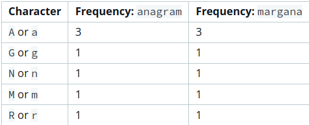
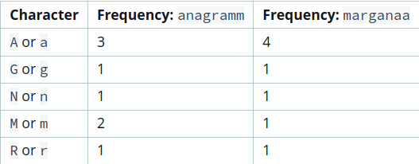
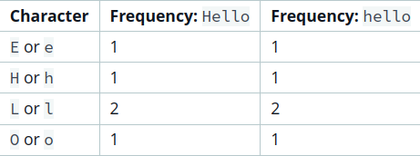

**Problem** 

Two strings, a and b, are called anagrams if they contain all the same characters in the same frequencies. For this challenge, the test is not case-sensitive. For example, the anagrams of CAT are CAT, ACT, tac, TCA, aTC, and CtA.

**Function Description**

Complete the isAnagram function in the editor.

isAnagram has the following parameters:

- string a: the first string
- string b: the second string

**Returns**

- boolean: If a and b are case-insensitive anagrams, return true. Otherwise, return false.

**Input Format**

The first line contains a string a.
The second line contains a string b.

**Constraints**

- 1 <= length(a), length(b) <= 50
- Strings  and  consist of English alphabetic characters.
- The comparison should NOT be case sensitive.

**Sample Input 0**

```
anagram
margana
```

**Sample Output 0**

```
Anagrams
```

**Explanation 0**



The two strings contain all the same letters in the same frequencies, so we print "Anagrams".

**Sample Input 1**

```
anagramm
marganaa
```

**Sample Output 1**

```
Not Anagrams
```

**Explanation 1**



The two strings don't contain the same number of a's and m's, so we print "Not Anagrams".

**Sample Input 2**

```
Hello
hello
```

**Sample Output 2**

```
Anagrams
```

**Explanation 2**



The two strings contain all the same letters in the same frequencies, so we print "Anagrams".


## starter code
```java
import java.util.Scanner;

public class Solution {

    static boolean isAnagram(String a, String b) {
        // Complete the function
    }

    public static void main(String[] args) {

        Scanner scan = new Scanner(System.in);
        String a = scan.next();
        String b = scan.next();
        scan.close();
        boolean ret = isAnagram(a, b);
        System.out.println( (ret) ? "Anagrams" : "Not Anagrams" );
    }

}
```